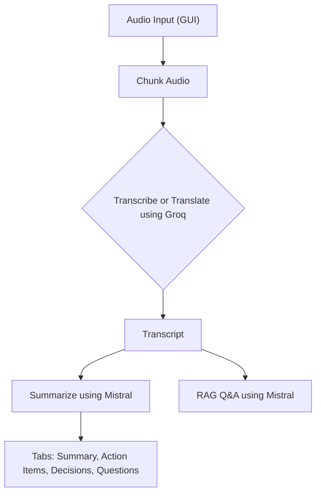

# MeetingFul - AI Meeting Assistant

MeetingFul is a modern, native Windows desktop application that turns raw meeting audio into clean transcripts, concise summaries, action items, and a searchable Q&A experience.

It features a sleek, dark-mode GUI built with CustomTkinter. The app records system audio (or accepts an existing audio file), sends it to Groq for fast transcription/translation, summarizes the content using Mistral, and enables retrieval-augmented generation (RAG) Q&A over the transcript so you can chat directly with your meetings.

## Highlights

- **Native Windows GUI**: A beautiful, user-friendly interface with built-in tabbed navigation.
- **Secure API Key Management**: The app prompts you for your Groq and Mistral API keys on startup—no need to manage `.env` files or hardcode secrets.
- **Audio Recording & Upload**: Record system audio directly (via Windows WASAPI loopback) or upload existing `.mp3`, `.wav`, or `.m4a` files.
- **Transcribe or Translate**: Process your audio in its original language, or translate it directly to English.
- **Smart Summaries**: Automatically generates full summaries, action items, key decisions, and open questions (formatted in clean, plain English).
- **RAG Chatbot**: An integrated chat interface that allows you to ask specific questions about the transcript and get instant answers.
- **Graceful Error Handling**: If summarization fails, the app safely skips it and still lets you use the RAG Chatbot.

## Project Flow



## Requirements

- **OS**: Windows is required if you want to use the "Record System Audio" feature (uses WASAPI loopback).
- **Python**: Python 3.12+
- **ffmpeg**: Must be installed and added to your system PATH (required by `pydub` for audio processing).
- **API Keys**:
  - **Groq API Key**: For transcription and translation.
  - **Mistral API Key**: For summarization and RAG Q&A.

## Setup & Execution

1. **Create and activate a virtual environment:**

```bash
python -m venv .venv
.venv\Scripts\activate
```

1. **Install dependencies:**

```bash
pip install -r requirements.txt
```

1. **Run the Application:**

```bash
python gui.py
```

*Upon launching, a window will pop up asking for your Groq and Mistral API keys. Once entered, the main dashboard will open.*

## Troubleshooting

- **No audio captured**: Make sure system audio is playing and your default speaker is set correctly in Windows.
- **ffmpeg errors**: Install ffmpeg and ensure it is available on your system PATH.
- **Unauthorized API Key**: Double-check that you entered valid API keys in the startup prompt. If an API call fails, the app will display the error safely in the logs or chat window without crashing.
- **RAG answers say "I could not find this information"**: Ensure your question is specific to the audio transcript provided.

## Project Structure

```
gui.py                     # Main GUI Application
requirements.txt           # Dependencies
images/
 └── logo.ico              # Application Icon
src/
 ├── audio_splitter.py
 ├── audio_transcriber.py
 ├── audio_translator.py
 ├── meeting_audio_processor.py
 ├── meeting_summarizer.py
 └── rag_pipeline.py
```
